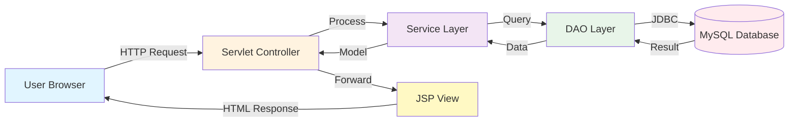

<div align="center">

# 🎯 Smart Customer Care System

### 🌈✨ Modern Java MVC Helpdesk Platform


[](https://opensource.org/licenses/MIT)
[](http://makeapullrequest.com)
[](https://github.com/yourusername/smart-customer-care/graphs/commit-activity)

*A powerful, animated, and user-friendly ticket management system built with Servlet + JSP + MySQL*

[🚀 Demo](#-demo) • [✨ Features](#-features) • [📦 Installation](#-installation-guide) • [🤝 Contributing](#-contributing)

</div>

---

## 🎬 Preview

<div align="center">

> 📌 **Add Your Dashboard GIF Here**
> 
> *Showcase your beautiful animated UI with a demo GIF*

</div>

---

## 📖 About The Project

Smart Customer Care System is a comprehensive helpdesk solution that streamlines customer support operations. Built with Java MVC architecture, it provides role-based dashboards for customers, support teams, managers, and administrators.

### 💡 Why This Project?

- ✅ **Modern UI/UX** - Gradient designs, smooth animations, and responsive layouts
- ✅ **Role-Based Access** - Secure authentication and authorization
- ✅ **Scalable Architecture** - Clean MVC pattern with separation of concerns
- ✅ **Production Ready** - Robust error handling and database optimization

---

## ✨ Features

<table>
<tr>
<td width="50%">

### 👤 Customer Portal
- 📝 Raise support tickets with categories
- 🔍 Real-time ticket status tracking
- 📜 Complete ticket history
- 📊 Personal dashboard with analytics
- 🔔 Notification system

</td>
<td width="50%">

### 🛠️ Technical Support
- 📥 View assigned tickets queue
- 🔧 Update ticket progress (Open → Working → Resolved)
- 📝 Add internal notes and comments
- ⏱️ Track response times
- 📈 Performance metrics

</td>
</tr>
<tr>
<td width="50%">

### 🧑‍💼 Manager Dashboard
- 👥 Account management system
- 📊 Advanced ticket insights & reports
- ✅ Approve/Reject ticket operations
- 📉 Team performance analytics
- 🎯 Resource allocation tools

</td>
<td width="50%">

### 🛡️ Admin Control Panel
- 📢 System-wide announcements
- 🔑 Role & permission management
- ⚙️ System configuration settings
- 📦 Database backup & restore
- 🔐 Security audit logs

</td>
</tr>
</table>

---

## 🎨 UI Highlights

<div align="center">

| Feature | Description |
|---------|-------------|
| 🌈 **Gradient Headers** | Eye-catching gradient backgrounds with smooth transitions |
| ✨ **Smooth Animations** | CSS3 animations for buttons, cards, and transitions |
| 🔄 **Hover Effects** | Interactive hover states for better UX |
| 📱 **Responsive Design** | Mobile-first approach with Bootstrap 5 |
| 💬 **Clean Interface** | Modern card layouts and organized information |
| 🎭 **Dark Mode Ready** | Prepared for dark theme implementation |

</div>

> 💡 **Pro Tip**: Add screenshots of your dashboards here to showcase your beautiful UI!

---

## 🏗️ Project Architecture

### MVC Pattern Implementation

```
smart-customer-care/
│
├── src/
│   ├── controller/              # Servlet Controllers
│   │   ├── CustomerController.java
│   │   ├── TicketController.java
│   │   ├── AdminController.java
│   │   └── ManagerController.java
│   │
│   ├── model/                   # Business Logic & POJOs
│   │   ├── User.java
│   │   ├── Ticket.java
│   │   ├── Category.java
│   │   └── Announcement.java
│   │
│   ├── dao/                     # Data Access Layer
│   │   ├── UserDAO.java
│   │   ├── TicketDAO.java
│   │   └── AnnouncementDAO.java
│   │
│   └── util/                    # Helper Utilities
│       ├── DBConnection.java
│       ├── PasswordUtil.java
│       └── ValidationUtil.java
│
├── webapp/
│   ├── views/                   # JSP Pages
│   │   ├── customer/
│   │   ├── support/
│   │   ├── manager/
│   │   └── admin/
│   │
│   ├── assets/                  # Static Resources
│   │   ├── css/
│   │   ├── js/
│   │   └── images/
│   │
│   └── WEB-INF/
│       ├── web.xml
│       └── lib/
│
└── database/
    └── smartcare.sql            # Database Schema
```

### 🔄 Request Flow



---

## 🚀 Tech Stack

<div align="center">

| Layer | Technology | Badge |
|-------|-----------|--------|
| **Frontend** | HTML5, CSS3, JavaScript, Bootstrap 5 |    |
| **Backend** | Java Servlets, JSP, JDBC |  |
| **Database** | MySQL 8.0+ |  |
| **Server** | Apache Tomcat 9.0+ |  |
| **Build Tool** | Maven / Manual |  |
| **Version Control** | Git & GitHub |  |

</div>

---

## 📦 Installation Guide

### Prerequisites

- ☕ Java JDK 8 or higher
- 🗄️ MySQL Server 8.0+
- 🚀 Apache Tomcat 9.0+
- 🛠️ IDE (IntelliJ IDEA / Eclipse / NetBeans)
- 📦 Maven (optional)

### Step-by-Step Setup

#### 1️⃣ Clone the Repository

```bash
git clone https://github.com/yourusername/smart-customer-care.git
cd smart-customer-care
```

#### 2️⃣ Import Project

**For IntelliJ IDEA:**
```
File → Open → Select project folder → Import as Dynamic Web Project
```

**For Eclipse:**
```
File → Import → Existing Projects into Workspace → Select root directory
```

#### 3️⃣ Setup Database

```sql
-- Create database
CREATE DATABASE smartcare CHARACTER SET utf8mb4 COLLATE utf8mb4_unicode_ci;

-- Use the database
USE smartcare;

-- Import the SQL file
SOURCE path/to/smartcare.sql;

-- Verify tables
SHOW TABLES;
```

#### 4️⃣ Configure Database Connection

Edit `src/util/DBConnection.java`:

```java
private static final String URL = "jdbc:mysql://localhost:3306/smartcare";
private static final String USERNAME = "your_mysql_username";
private static final String PASSWORD = "your_mysql_password";
```

#### 5️⃣ Configure Tomcat Server

1. Add Tomcat server in your IDE
2. Deploy the project to Tomcat
3. Set context path: `/smartcare`

#### 6️⃣ Run the Application

```bash
# Start Tomcat server
# Then open browser and navigate to:
http://localhost:8080/smartcare
```

### 🎉 Default Login Credentials

| Role | Username | Password |
|------|----------|----------|
| Admin | admin | admin123 |
| Manager | manager | manager123 |
| Support | support | support123 |
| Customer | customer | customer123 |

> ⚠️ **Important**: Change these credentials after first login!

---


<td width="50%">

### 🚀 Improvements
- 🌙 Dark mode implementation
- 📱 Progressive Web App (PWA)
- 🔐 Two-factor authentication
- 📁 File attachment support
- 🌍 Multi-language support

</td>
</tr>
</table>

---

## 🤝 Contributing

Contributions make the open-source community an amazing place to learn, inspire, and create. Any contributions you make are **greatly appreciated**!

### How to Contribute

1. 🍴 Fork the Project
2. 🌿 Create your Feature Branch (`git checkout -b feature/AmazingFeature`)
3. ✍️ Commit your Changes (`git commit -m 'Add some AmazingFeature'`)
4. 📤 Push to the Branch (`git push origin feature/AmazingFeature`)
5. 🎉 Open a Pull Request

### Contribution Guidelines

- Follow clean code principles
- Write meaningful commit messages
- Add comments for complex logic
- Update documentation for new features
- Test thoroughly before submitting PR

---


---

## 👨‍💻 Author

<div align="center">

### **Your Name**

[](https://github.com/yourusername)
[](https://linkedin.com/in/yourprofile)
[](mailto:your.email@example.com)
[](https://yourportfolio.com)

*Full Stack Developer | Java Enthusiast | Open Source Contributor*

</div>

---


---

## 📞 Support

Having issues? We're here to help!

- 📧 Email: support@smartcare.com
- 💬 Discussions: [GitHub Discussions](https://github.com/yourusername/smart-customer-care/discussions)
- 🐛 Bug Reports: [Issue Tracker](https://github.com/yourusername/smart-customer-care/issues)
- 📖 Documentation: [Wiki](https://github.com/yourusername/smart-customer-care/wiki)

---

<div align="center">

### 🌟 If you find this project helpful, please give it a star!

Made with ❤️ by [Your Name](https://github.com/yourusername)

**Happy Coding!** 🚀

</div>
